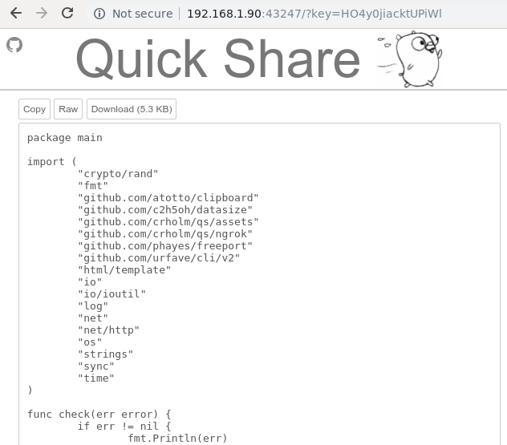
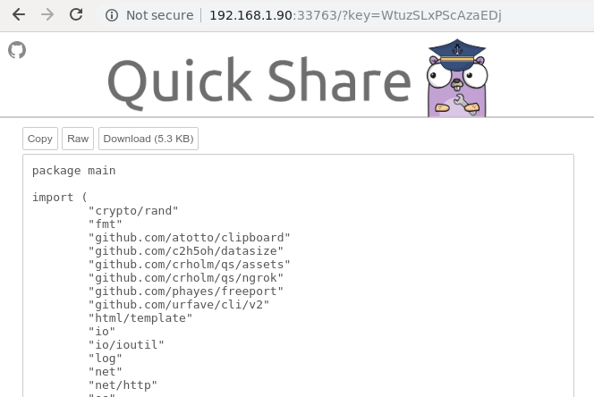

# qs - Quick Share
Share text snippets and files on your local network through http

```bash
$ go get github.com/crholm/qs

$ qs --help  
NAME:
   qs - Quick Share creates a local web server in order to share text snippets and files 
        on your local network through http

USAGE:
   echo "foo bar" | qs [global options]
   qs [global options] [filename]

COMMANDS:
   help, h  Shows a list of commands or help for one command

GLOBAL OPTIONS:
   --nokey      no access key is needed to view content  (default: false)
   --noclip     do not copy url to clipboard (default: false)
   --ascii, -a  will treat a file as text input and display it on the web, just as for 
                std in (default: false)
   --once, -o   terminates the server after first page load, so things dont hang around 
                (copies curl command to clipboard) (default: false)
   --ngrok, -n  starts an ngrok instance linking the snippet to it, see https://ngrok.com/. 
                Make sure to have it in your $PATH (default: false)
   --help, -h   show help (default: false)
```


**Usage**
```bash
$ echo A string to share | qs
Avalible at 
  http://192.168.1.90:33361?key=tvfrMDT7nalI3zpn
  curl -o "qs_2020-01-10T10:40:51+01:00.txt" "http://192.168.1.90:33361/download?key=tvfrMDT7nalI3zpn"
and url is copied to clipboard

$ qs main.go 
Avalible at 
  http://192.168.1.90:36437?key=d5DZptt3pAopFh47
  curl -o "main.go" "http://192.168.1.90:36437/download?key=d5DZptt3pAopFh47"
and url is copied to clipboard


## Will terminat the server after first requet

$ echo A string to share | qs -o
Avalible once at 
  http://192.168.1.90:41785?key=G3gPL9RmhEvCPEH4
  curl -o "qs_2020-01-10T10:42:07+01:00.txt" "http://192.168.1.90:41785/download?key=G3gPL9RmhEvCPEH4"
and curl is copied to clipboard

$ qs -o main.go 
Avalible once at 
  http://192.168.1.90:35627?key=buieogrUSCeRUOTK
  curl -o "main.go" "http://192.168.1.90:35627/download?key=buieogrUSCeRUOTK"
and curl is copied to clipboard
```

**Examples**

```bash
$ cat main.go | sq
Avalible at
  http://192.168.1.90:43247?key=HO4y0jiacktUPiWl
  curl -o "qs_2020-01-16T11:42:18+01:00.txt" "http://192.168.1.90:43247/download?key=HO4y0jiacktUPiWl"
and url is copied to clipboard

```


```bash 
$ sq example0.png
Avalible at
  http://192.168.1.90:40393?key=sGjbagdwqly1AyoS
  curl -o "example0.png" "http://192.168.1.90:40393/download?key=sGjbagdwqly1AyoS"
and url is copied to clipboard
```


